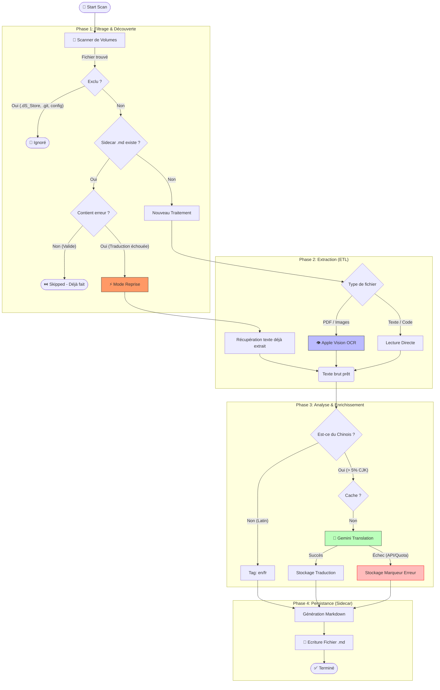

# Indexao Pipeline Architecture

Ce document décrit le flux de traitement des fichiers (Pipeline) utilisé par Indexao v2.
Il détaille comment un fichier source est transformé en fichier Sidecar (`.md`) prêt pour l'indexation.

## Vue d'ensemble (Flowchart)

Le diagramme ci-dessous illustre la logique de décision, y compris les exclusions, le mécanisme de **reprise sur erreur** et l'optimisation pour éviter de réeffectuer l'OCR.

## Détails des composants

### 1. Le Scanner (`scanner.py`)
Il parcourt récursivement les dossiers définis dans `config.toml`.
*   **Exclusions** : Filtre les fichiers cachés, les fichiers systèmes, et les patterns définis par l'utilisateur.
*   **Protection** : Ignore automatiquement les fichiers `.md` pour éviter de scanner les sidecars générés par lui-même.

### 2. Le Pipeline (`pipeline.py`)
C'est le chef d'orchestre du traitement unitaire d'un fichier.

#### Logique de Reprise (Smart Resume)
Contrairement à un simple "Skip si existe", le pipeline inspecte le contenu du sidecar existant.
S'il détecte des marqueurs comme `> ⚠️ Traduction échouée`, il ne saute pas le fichier. Au contraire :
1.  Il **lit le texte extrait** dans le `.md` corrompu.
2.  Il saute l'étape OCR (qui est la plus coûteuse en temps).
3.  Il relance uniquement la phase de traduction.

#### Extraction
*   **Documents Scan/Image** : Utilise le wrapper `AppleVisionOCR` (natif macOS) pour une extraction rapide et locale sans upload.
*   **Documents Texte** : Lecture directe (utf-8).

#### Traduction (LLM)
*   Déclencheur : Un ratio de caractères CJK (Chinois/Japonais/Coréen) supérieur à 5%.
*   Provider : Google Gemini Flash.
*   Stratégie : Rotation de clés API pour maximiser le débit.
